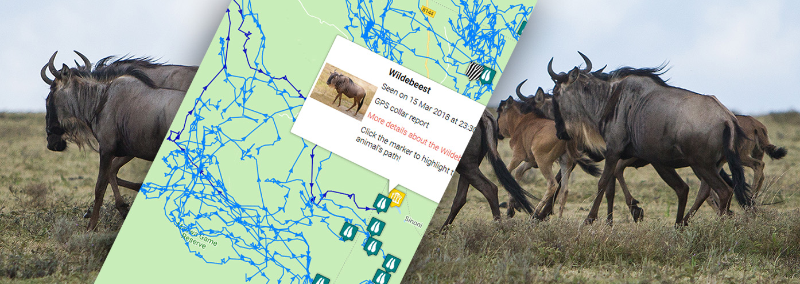

# Wildlife Tracker
#### Wildlife Tracker, July 28th 2023
#### By Charles Jumah


## Description

```bash
An application that allows Rangers to track wildlife sightings in the area.
```

## >>TOC

- [Installation](#Installation)
- [SQL](#SQL)
- [Tests](#Tests)
- [Live Demo](#Tests)
- [Requirements](#Requirements)
- [Known Bugs](#Requirements)
- [Extras](#extras)


## >>Technologies Used
[](https://forthebadge.com)
[](https://forthebadge.com)
[](https://forthebadge.com)
[](https://forthebadge.com)

## >>Installation
* `git clone <https://github.com/cjumah/WildlifeTracker.git>` this repository
* `cd WildlifeTracker`


## >>Live Demo
View page unavailable. Heroku free package unavailable.

## >>Tests

- To run test, run files under tests/java package 


## >>SQL
```bash
1.Launch postgres

2.Type in psql

Run these commands

3. CREATE DATABASE wildlife_tracker;

4. \c wildlife_tracker;

5. CREATE TABLE animals (id serial PRIMARY KEY, name varchar, health varchar, age varchar, type varchar);

6. CREATE TABLE wildlife_tracker=# CREATE TABLE sightings (id serial PRIMARY KEY, animal_id int, location varchar, ranger_name varchar, timestamp timestamp);

7. CREATE DATABASE wildlife_tracker_test WITH TEMPLATE wildlife_tracker;

```
## >>Requirements
```bash
The applications allow users to do the following:

1.Add a new animal
 
2.Add an endangered animal

3.Add an animal Sighting

```

## >> Known Bugs 
- There are currently no tests done for this project.
- As at the time this project was made, responsiveness was not a major concern 
- Thanks for your time. Feedback is appreciated.


## >>Contact Details
```bash
You can contact me at cnunda@gmail.com
```

## >>License
- This project is licensed under the MIT Open Source license Copyright (c) Charles Jumah 2023.
